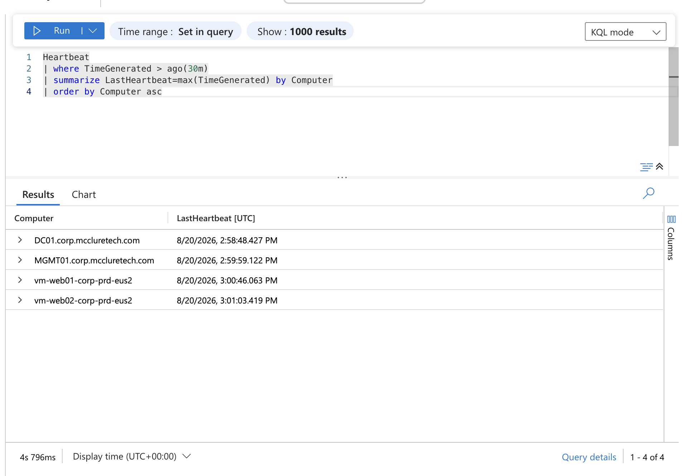
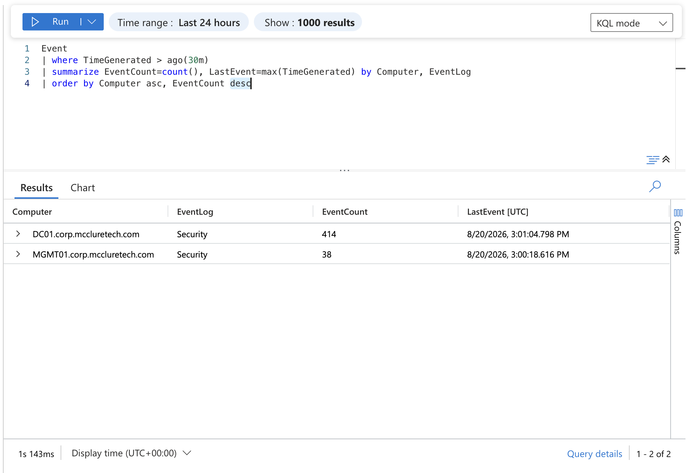
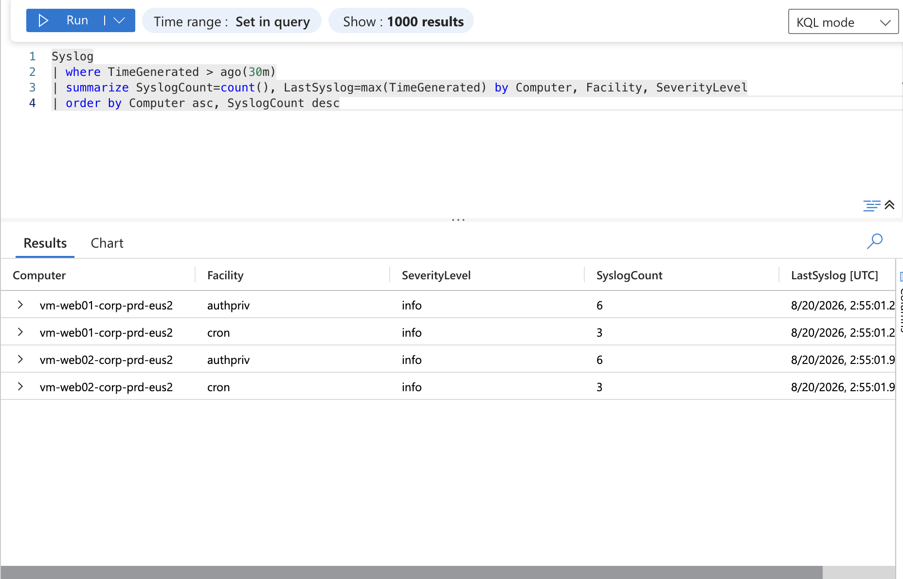

# Enterprise Azure Lab - Security Design

**Version:** 1.6  
**Last Updated:** August 20, 2026  
**Author:** Kendrick McClure

---

## Overview

This document outlines the security architecture, implemented controls, and security-focused design decisions within the Azure Enterprise Lab.

The environment uses layered security controls, network segmentation, private administrative access, centralized identity, group-based authorization, workload separation, and explicitly defined outbound connectivity to reduce unnecessary exposure of infrastructure resources.

Security controls are implemented across multiple layers of the environment, including:

- Azure network architecture
- Network Security Groups
- Azure Firewall
- Private workload addressing
- Administrative access
- Active Directory Domain Services
- Group Policy
- Security group-based authorization
- Windows NTFS permissions
- Internal application delivery
- Explicit outbound Internet connectivity
- Centralized Windows and Linux telemetry collection

The current architecture is shown below.

The editable source for the architecture diagram is maintained in [../diagrams/azure-enterprise-lab-topology.drawio](../diagrams/azure-enterprise-lab-topology.drawio).

---

# Security Principles

The environment applies defense in depth rather than relying on a single security mechanism.

Current security principles include:

- Least privilege
- Network segmentation
- Private workload addressing
- Private administrative access
- Reduced public exposure
- Explicit outbound connectivity
- Separation of infrastructure roles
- Group-based authorization
- Centralized identity and policy management

These principles are implemented through complementary controls across the network, administrative, identity, authorization, and workload layers.

Network Security Groups provide subnet-level traffic filtering, while Azure Bastion provides centralized administrative connectivity to privately addressed workloads. Azure Firewall provides centralized outbound traffic control and policy enforcement for private Corporate workloads.

Active Directory Domain Services provides centralized authentication and identity management. Group Policy provides centralized Windows security configuration, while Active Directory security groups and NTFS permissions provide resource-level authorization.

The internal application tier remains privately addressed and uses an internal Azure Load Balancer for application delivery and backend health monitoring.

Together, these controls provide multiple security boundaries while allowing additional security services to be introduced as the environment develops.

---

# Network Security Groups

Network Security Groups are used to control traffic at the subnet level and provide network-layer access controls between infrastructure segments.

Current NSG assignments include:

| Network Security Group | Associated Subnet | Purpose |
| --- | --- | --- |
| `nsg-hub-management-prd-eus2` | `snet-hub-management-prd-eus2` | Protects shared Hub management infrastructure |
| `nsg-corp-management-prd-eus2` | `snet-corp-management-prd-eus2` | Protects Corporate administrative systems |
| `nsg-corporate-identity-prd-eus2` | `snet-identity-prd-eus2` | Protects Corporate identity infrastructure |
| `nsg-corporate-internal-apps-prd-eus2` | `snet-corporate-internal-apps-prd-eus2` | Protects the internal application tier |

The Internal Apps workload currently uses HTTP on TCP port 80.

HTTPS on TCP port 443 is reserved for future TLS-enabled application traffic but is not currently implemented by the Nginx workload.

Network Security Groups provide traffic filtering based on source, destination, protocol, and port. They are not treated as replacements for centralized firewalling, application-layer inspection, endpoint protection, or identity-based access controls.

Additional east-west segmentation and more granular NSG rules are planned as future hardening improvements.

---

# Administrative Access

Administrative access to server virtual machines is centralized through Azure Bastion when interactive access is required.

DC01, MGMT01, WEB01, and WEB02 do not have direct public IP addresses.

Azure Bastion is deployed within the Hub Virtual Network and reaches privately addressed server resources in the Corporate Virtual Network across VNet peering.

| Property | Value |
| --- | --- |
| Name | `bas-hub-prd-eus2` |
| Resource Group | `rg-connectivity-prd-eus2` |
| Public IP Resource | `pip-bastion-hub-prd-eus2` |

This design allows RDP and SSH administration without directly exposing those management services from the server workloads to the public Internet.

Centralizing interactive administrative access through Bastion reduces direct public exposure while preserving access to privately addressed Windows and Linux infrastructure.

Because Azure Bastion is a billable lab resource, it may be deployed or removed as required while the underlying private server architecture remains unchanged.

---

# Virtual Network Segmentation

Network segmentation separates infrastructure according to workload function so that network controls and future security policies can be applied according to the requirements of each segment.

The Hub contains shared connectivity and administrative infrastructure, while the Corporate VNet separates workload infrastructure into dedicated network segments.

Current and reserved Corporate segments include:

- **Identity** - Active Directory Domain Services and DNS
- **Management** - Administrative systems and management tooling
- **Internal Applications** - Internal application workloads
- **Private Endpoints** - Reserved for future private connectivity to supported Azure services

The Identity, Management, and Internal Applications subnets currently host deployed infrastructure.

Separating identity, administrative, and application workloads reduces the need to place unrelated systems within the same network segment and provides clearer boundaries for applying network controls as the environment expands.

---

# Outbound Connectivity and Azure Firewall Security Boundary

The active Corporate workload subnets are configured as private subnets with default outbound access disabled.

Current private workload subnets include:

- `snet-identity-prd-eus2`
- `snet-corp-management-prd-eus2`
- `snet-corporate-internal-apps-prd-eus2`

Server workloads within these subnets remain privately addressed and do not rely on Azure default outbound access for Internet connectivity.

Internet-bound traffic from these subnets is directed to Azure Firewall in the Hub Virtual Network using a User Defined Route.

| Property | Value |
| --- | --- |
| Firewall | `fw-hub-prd-eus2` |
| Resource Group | `rg-connectivity-prd-eus2` |
| Firewall Tier | Basic |
| Private IP | `10.0.0.4` |
| Route Table | `rt-corporate-egress-prd-eus2` |
| Route | `0.0.0.0/0` |
| Next Hop Type | Virtual Appliance |
| Next Hop Address | `10.0.0.4` |

The route table is associated with the active Corporate workload subnets, providing a centralized outbound path through Azure Firewall.

Azure Firewall policy controls which outbound connections are permitted from those workloads. Traffic that does not match an applicable allow rule is denied by default.

This allows DC01, MGMT01, WEB01, and WEB02 to remain privately addressed while outbound Internet connectivity is centrally controlled according to workload requirements.

### Security Boundary

Azure Firewall provides a centralized security boundary for Internet-bound Corporate workload traffic.

The firewall is used to:

- Enforce explicit outbound connectivity requirements
- Apply centralized network and application rules
- Restrict unnecessary Internet access
- Provide default-deny behavior for unmatched outbound traffic
- Maintain private addressing on Corporate server workloads

Azure Firewall operates alongside, rather than replacing, other security controls such as:

- Network Security Groups
- Host-based security controls
- Identity-based authorization
- Application security controls

This layered approach allows subnet-level controls and centralized outbound policy enforcement to serve different security functions within the environment.

---

# Centralized Monitoring and Logging

Azure Monitor and Log Analytics provide centralized telemetry collection across the Windows and Linux server environment.

Azure Monitor Agent is deployed to DC01, MGMT01, WEB01, and WEB02. The `dcr-corporate-servers-prd-eus2` Data Collection Rule defines the telemetry collected from these systems:

- Windows Security Events from DC01 and MGMT01
- Linux Syslog from WEB01 and WEB02
- Heartbeat data from all four monitored virtual machines

Collected telemetry is sent to the `law-management-prd-eus2` Log Analytics workspace. Because the Corporate workload subnets use explicit outbound routing, required Azure Monitor Agent communication traverses Azure Firewall over HTTPS/443.

Telemetry ingestion was validated in Log Analytics using KQL queries against Heartbeat, Event, and Syslog data.

### VM Heartbeat Validation

The Heartbeat table confirmed active Azure Monitor Agent communication from all four monitored virtual machines.

### Windows Security Event Validation

The Event table confirmed Windows Security Event collection from DC01 and MGMT01.

### Linux Syslog Validation

The Syslog table confirmed Linux Syslog collection from WEB01 and WEB02.

---

# Internal Application Security

The internal application tier consists of WEB01 and WEB02 behind an internal Azure Load Balancer with the private frontend address 10.1.3.10.

The application currently uses HTTP on TCP port 80.

Security characteristics of the design include:

- Internal-only Load Balancer frontend
- No public frontend IP for the application
- No direct public IP addresses on WEB01 or WEB02
- Dedicated Internal Apps subnet
- Subnet-level Network Security Group
- Private application delivery to the backend tier
- Backend health monitoring
- Outbound traffic routed through Azure Firewall

Clients access the application through the Load Balancer frontend rather than directly targeting individual backend systems.

Outbound connectivity from the Internal Apps subnet is centrally controlled through Azure Firewall policy.

The Load Balancer is not treated as a firewall. Its role is application traffic distribution and backend availability monitoring rather than application-layer security inspection.

---

# Active Directory Security

Active Directory Domain Services provides centralized authentication and identity management for the Windows environment.

The domain is `corp.mccluretech.com`.

Current identity-security controls include:

- Dedicated Domain Controller
- Dedicated Identity subnet
- Active Directory-integrated DNS
- Organizational Unit separation
- Dedicated domain-joined management server
- Security group-based resource authorization
- Group Policy-based server configuration
- Separation of administrative, user, server, workstation, group, service account, and disabled objects

The Organizational Unit structure provides a foundation for applying security policy and administrative controls according to object type and workload function.

## Administrative Separation

Domain infrastructure is separated from routine administrative workloads.

DC01 hosts Active Directory Domain Services and DNS, while MGMT01 provides a dedicated domain-joined platform for routine Active Directory, DNS, Group Policy, and Windows infrastructure administration.

This separation reduces the need to perform routine administrative activity directly on critical identity infrastructure.

MGMT01 is organized within the custom `Servers` OU and receives server-specific Group Policy through that structure.

Administrative connectivity to the infrastructure is provided through Azure Bastion.

Additional privilege separation and delegated administration controls can be introduced as the identity architecture develops.

---

# Group Policy Security

Group Policy is used to centrally apply Windows configuration and security settings to domain-joined systems.

A dedicated Group Policy Object was created:

`GPO-Servers-Baseline`

The GPO is linked to the custom `Servers` OU.

The initial security baseline configures:

`Accounts: Guest account status` → `Disabled`

The policy is configured under:

`Computer Configuration > Policies > Windows Settings > Security Settings > Local Policies > Security Options`

Creating a dedicated server baseline GPO keeps custom server security settings separate from the Default Domain Policy.

This provides a scalable foundation for introducing additional Windows Server security controls without placing workload-specific configuration into Microsoft's default domain policies.

Future baseline improvements can include additional security options, auditing, Windows Defender settings, firewall configuration, and other server-hardening controls.

---

# Group-Based Authorization

Resource access is assigned through Active Directory security groups rather than directly to individual user accounts.

The initial file-services implementation follows an AGDLP-style authorization model:

**Accounts → Global Group → Domain Local Group → Permission**

Current implementation:

- Test users are assigned to `GG-IT-Users`
- `GG-IT-Users` is nested within `DL-ITShare-RW`
- `DL-ITShare-RW` represents read/write access to the ITShare resource
- `DL-ITShare-RW` receives NTFS Modify permissions on the resource

This separates user-role membership from resource authorization.

If access requirements change, administrators can modify security-group membership rather than repeatedly modifying permissions directly on the resource.

This approach scales more effectively than assigning NTFS permissions directly to individual user accounts.

---

# NTFS Permission Security

The `ITShare` resource hosted on MGMT01 is used to implement and validate group-based Windows resource authorization.

The resulting NTFS ACL includes:

| Principal | Permission |
| --- | --- |
| `DL-ITShare-RW` | Modify |
| SYSTEM | Full Control |
| Local Administrators | Full Control |

Normal user access to the resource is controlled through the intended Domain Local security group while required SYSTEM and local administrative permissions are preserved.

Detailed permission troubleshooting and validation are maintained in the [Troubleshooting](troubleshooting.md) documentation.

---

# Current Security Controls

The environment currently implements security controls across network, administrative, identity, authorization, and workload layers.

- Private server addressing with no direct public IP assignments
- Centralized administrative access through Azure Bastion
- Functional network segmentation with subnet-level Network Security Groups
- Private Corporate subnets with default outbound access disabled and centralized Azure Firewall egress
- User Defined Routes directing Internet-bound Corporate workload traffic through Azure Firewall
- Explicit firewall policy with default-deny behavior for unmatched outbound traffic
- Separation of Domain Controller and routine administrative workloads
- Centralized authentication and DNS through Active Directory Domain Services
- Organizational Unit structure and Group Policy-based server security configuration
- AGDLP-style security-group authorization with controlled NTFS resource permissions
- Private internal application delivery through Azure Load Balancer
- Backend health monitoring for the internal application tier

These controls represent the currently implemented security state of the environment. Additional security services listed in the project roadmap are not represented as deployed controls.

---

# Security Validation

Security controls are functionally tested to confirm that implemented configurations behave as intended rather than relying solely on configuration state.

Major validation performed within the environment includes:

- **Administrative access:** Validated private administrative connectivity to Windows and Linux workloads without direct public IP assignments.
- **Identity and policy:** Validated Active Directory domain authentication, DNS resolution and service discovery, Organizational Unit placement, and Group Policy configuration.
- **Resource authorization:** Validated Active Directory security-group nesting and NTFS access through the intended Domain Local security group.
- **Outbound connectivity:** Validated centralized outbound routing through Azure Firewall, including successful permitted Azure KMS traffic over TCP port 1688 and denial of unmatched outbound web traffic.
- **Internal application delivery:** Validated private Load Balancer frontend connectivity, backend health monitoring, traffic delivery to Nginx systems, and continued application availability following intentional backend failure.
- **Monitoring and logging:** Validated Azure Monitor Agent communication and centralized telemetry ingestion using KQL, including Heartbeat data from all four VMs, Windows Security Events from DC01 and MGMT01, and Linux Syslog from WEB01 and WEB02.

Detailed troubleshooting, remediation, and validation scenarios are maintained in the [Troubleshooting](troubleshooting.md) documentation.

---

# Future Security Enhancements

Planned security improvements include:

- Microsoft Defender for Cloud
- Azure Policy
- Azure Key Vault
- Just-In-Time VM Access
- Network monitoring and diagnostics
- Additional identity security controls
- Additional Group Policy server-hardening settings
- More granular administrative privilege delegation
- Expanded role-based security groups
- Windows auditing configuration
- Additional application security controls
- TLS for internal web workloads
- Private Endpoint implementation
- Infrastructure security automation

These services and controls are planned enhancements and should not be interpreted as currently deployed infrastructure.

---

# Summary

The Azure Enterprise Lab applies layered security controls across networking, administrative access, identity, authorization, Windows policy, internal application delivery, and centralized telemetry collection.

The current design emphasizes private workload addressing, functional network segmentation, centralized administrative access, controlled outbound connectivity through Azure Firewall, centralized identity and policy management, group-based resource authorization, and centralized Windows and Linux telemetry collection. Implemented controls are functionally validated rather than treated as effective based solely on configuration state.

The environment provides a foundation for introducing additional controls such as Microsoft Defender for Cloud, Azure Policy, Key Vault, expanded Windows hardening, and additional identity-security capabilities as the project develops.
