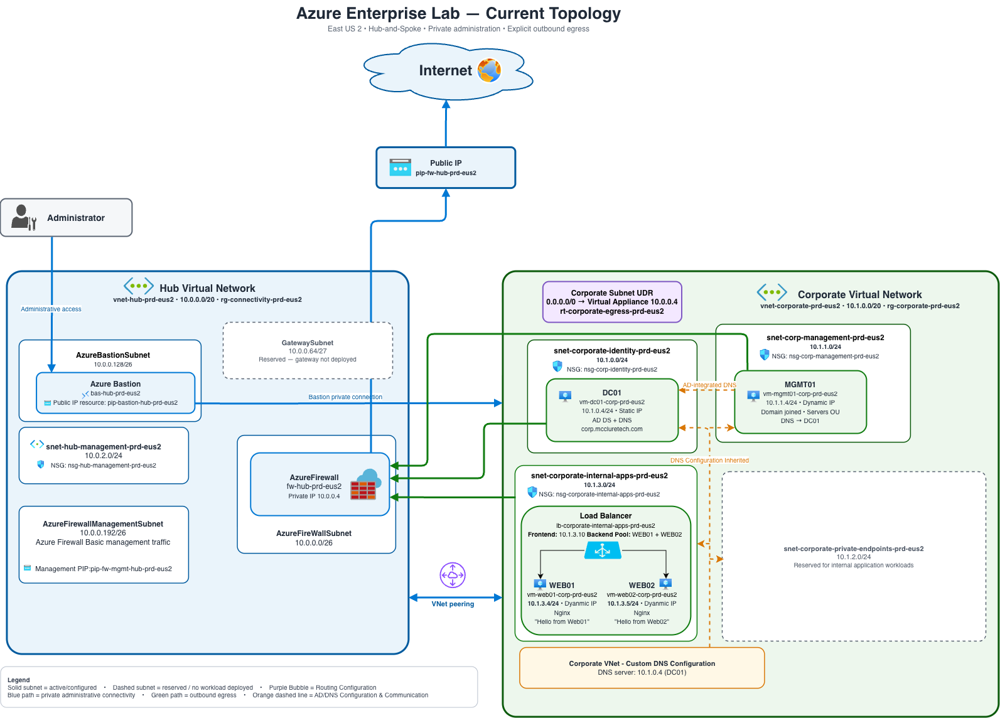
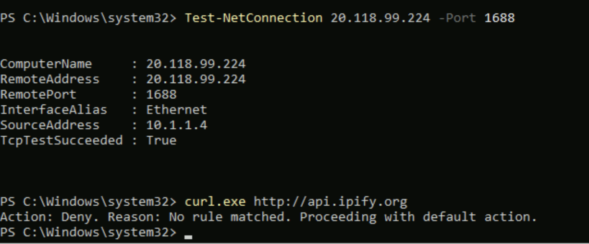
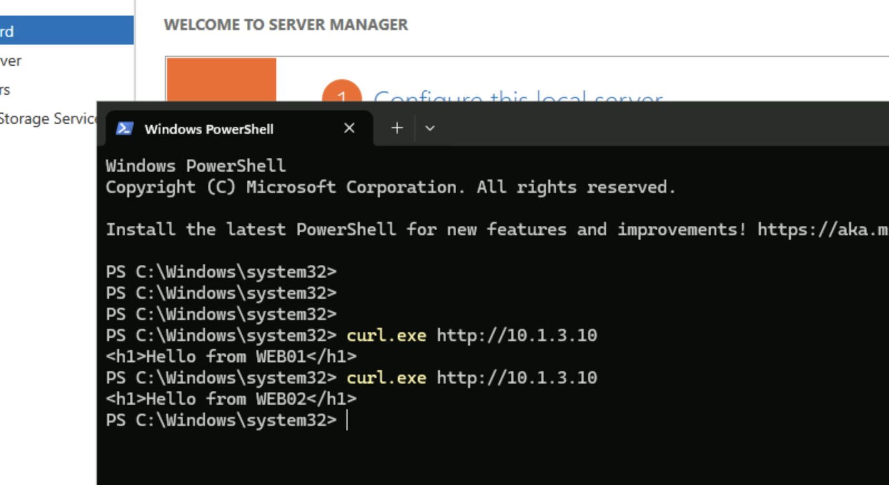

# Enterprise Azure Lab - Troubleshooting

**Version:** 1.5  
**Last Updated:** August 20, 2026  
**Author:** Kendrick McClure

---

## Overview

This document records meaningful technical issues encountered while building the Azure Enterprise Lab, including investigation, root cause analysis, remediation, validation, and lessons learned.

Entries focus on situations that required troubleshooting or corrective action rather than documenting routine configuration tasks as troubleshooting events.

The current network architecture is shown below for reference.



The editable source for the architecture diagram is maintained in [../diagrams/azure-enterprise-lab-topology.drawio](../diagrams/azure-enterprise-lab-topology.drawio).

---

# Issue #1 - VM Had No Outbound Internet Connectivity

## Symptoms

During the initial deployment of server infrastructure, a virtual machine was accessible through Azure Bastion but could not establish outbound HTTPS connectivity.

Observed behavior included:

- Azure Bastion connectivity was successful
- The virtual machine received a valid private IP address
- DNS resolution functioned correctly
- Windows Server displayed an activation warning
- Outbound HTTPS connectivity failed

TCP connectivity to an external HTTPS endpoint was tested using:

```powershell
Test-NetConnection www.microsoft.com -Port 443
```

Result:

```text
TcpTestSucceeded : False
```

The result indicated that the virtual machine could resolve the destination but could not successfully establish the outbound TCP connection.

---

## Investigation

The network path was evaluated layer by layer to isolate the failed component.

### DNS Resolution

External DNS resolution was tested using:

```powershell
nslookup www.microsoft.com
```

Name resolution completed successfully, confirming that DNS was functioning but not proving that outbound application connectivity was available.

### TCP Connectivity

Outbound TCP/443 connectivity was tested separately:

```powershell
Test-NetConnection www.microsoft.com -Port 443
```

Result:

```text
TcpTestSucceeded : False
```

The difference between successful DNS resolution and failed TCP connectivity narrowed the investigation to outbound network connectivity rather than name resolution.

### Azure Network Configuration

The relevant Azure network configuration was then reviewed.

Validation confirmed:

- The virtual machine had a valid private IP address
- An active default route to the Internet existed
- The effective Network Security Group configuration permitted outbound traffic
- No User Defined Route was associated with the affected subnet
- Azure Bastion connectivity remained functional

With addressing, DNS, routing, and NSG configuration validated, the investigation shifted to the subnet's outbound connectivity configuration.

---

## Root Cause

The affected workload subnet was configured as a **private subnet with default outbound access disabled**.

At that stage of deployment, no explicit outbound connectivity method had been configured for the subnet.

The virtual machine therefore had functioning private networking and DNS resolution but did not have an explicitly configured mechanism for establishing outbound Internet connections.

This explained why Azure Bastion connectivity and DNS resolution could function while outbound HTTPS connectivity failed.

---

## Temporary Resolution

Default outbound connectivity was temporarily permitted so deployment activities requiring Internet access could continue.

After the subnet configuration was changed, the existing virtual machine did not immediately exhibit the expected outbound behavior. The virtual machine was stopped and deallocated through Azure and then started again.

Outbound HTTPS connectivity was retested:

```powershell
Test-NetConnection www.microsoft.com -Port 443
```

Result:

```text
TcpTestSucceeded : True
```

The temporary configuration restored the required connectivity but was not retained as the intended outbound architecture.

---

## Initial Architectural Resolution - NAT Gateway

The outbound architecture was initially updated to provide an explicitly configured egress path for the private Corporate workload subnets.

Azure NAT Gateway was deployed with a dedicated static Public IP resource.

| Property | Value |
| --- | --- |
| NAT Gateway | `nat-corp-prd-eus2` |
| Resource Group | `rg-connectivity-prd-eus2` |
| Public IP Resource | `pip-nat-corp-prd-eus2` |

The NAT Gateway was associated with:

- `snet-identity-prd-eus2`
- `snet-corp-management-prd-eus2`
- `snet-corporate-internal-apps-prd-eus2`

Azure NAT Gateway performed Source Network Address Translation (SNAT) for outbound connections originating from the associated private subnets.

This provided an explicit outbound Internet path without assigning direct public IP addresses to the server virtual machines.

After NAT Gateway was implemented, the workload subnets were returned to private subnet configuration with default outbound access disabled.

The NAT Gateway architecture successfully provided explicit outbound connectivity and predictable source translation. It was later replaced as the environment evolved toward centralized outbound traffic filtering and policy enforcement.

---

## Architecture Evolution - Centralized Firewall Egress

The outbound architecture was subsequently migrated from Azure NAT Gateway to Azure Firewall.

The NAT Gateway and its associated Public IP resource were removed, and a User Defined Route was introduced to direct Internet-bound traffic from the Corporate workload subnets to Azure Firewall in the Hub Virtual Network.

The configured default route is:

```text
0.0.0.0/0 → Virtual Appliance → 10.0.0.4
```

The route table is associated with:

- `snet-identity-prd-eus2`
- `snet-corp-management-prd-eus2`
- `snet-corporate-internal-apps-prd-eus2`

This provides a centralized outbound path through Azure Firewall while allowing the Corporate workloads to remain privately addressed with default outbound access disabled.

Unlike the previous NAT Gateway architecture, Azure Firewall provides centralized policy enforcement that allows outbound traffic to be explicitly permitted or denied according to workload requirements.

---

## Validation

The resulting Azure Firewall egress architecture was validated from MGMT01 after the User Defined Route and firewall policy were implemented.

Internal network functionality was first validated to confirm that the routing changes had not disrupted Active Directory dependencies.

Validation confirmed:

- MGMT01 continued using DC01 at `10.1.0.4` for DNS
- Internal DNS resolution remained functional
- The Active Directory secure channel remained healthy
- Corporate workload subnets remained configured as private subnets
- Default outbound access remained disabled
- Internet-bound traffic was directed toward Azure Firewall through the configured User Defined Route
- Server virtual machines remained without direct public IP assignments

Permitted Azure KMS activation traffic was tested from MGMT01:

```powershell
Test-NetConnection 20.118.99.224 -Port 1688
```

Result:

```text
TcpTestSucceeded : True
```

An unmatched outbound web request was then tested:

```powershell
curl.exe http://api.ipify.org
```

Azure Firewall denied the request because no applicable allow rule matched the traffic.



*Azure Firewall egress policy validation demonstrating successful permitted Azure KMS traffic over TCP/1688 and denial of unmatched outbound web traffic.*

Together, these tests confirmed that the intended centralized outbound architecture was functioning and that firewall policy was capable of both permitting required traffic and denying traffic that was not explicitly allowed.

---

## Lessons Learned

### DNS Resolution Does Not Prove End-to-End Connectivity

Successful DNS resolution confirms that a hostname can be resolved but does not prove that the required TCP connection can be established.

Testing DNS and TCP connectivity independently helped isolate the failure to outbound connectivity rather than name resolution.

### Troubleshoot Network Connectivity Layer by Layer

Validating private addressing, DNS, protocol connectivity, effective routes, NSGs, route tables, and subnet configuration independently reduced guesswork and helped isolate the actual failure.

Successful Azure Bastion connectivity also did not imply that the workload itself had outbound Internet connectivity because administrative access and workload egress use different network paths.

### Validate the Resulting Architecture

Restoring connectivity was not treated as sufficient validation.

After centralized outbound routing through Azure Firewall was implemented, both permitted and unmatched traffic were tested to confirm that the resulting architecture provided required connectivity while enforcing the intended firewall policy.

This confirmed that the intended architecture was actually being used and that successful connectivity alone was not being treated as proof of correct security behavior.

---

# Issue #2 - Overly Broad NTFS Permissions on ITShare

## Symptoms

During validation of the `ITShare` resource on MGMT01, the intended Active Directory authorization structure was:

```text
User Account
    ↓
GG-IT-Users
    ↓
DL-ITShare-RW
    ↓
ITShare
```

`DL-ITShare-RW` was assigned NTFS Modify access to the resource.

During review of the folder's permissions, an additional access path was discovered:

```text
Authenticated Users - Modify
```

This permission was inherited from the parent filesystem structure.

As a result, membership in the intended Active Directory security groups was not the only mechanism capable of granting normal user access to the resource.

---

## Investigation

The complete NTFS ACL was reviewed rather than validating only that `DL-ITShare-RW` had been successfully added.

The review confirmed that `Authenticated Users` inherited Modify permissions from the parent filesystem structure.

This conflicted with the intended authorization model:

```text
User Account
    ↓
GG-IT-Users
    ↓
DL-ITShare-RW
    ↓
NTFS Modify
```

Leaving the inherited permission in place could allow authenticated users to receive access independently of membership in the intended security groups.

---

## Root Cause

The issue was caused by inherited NTFS permissions from the parent filesystem structure.

Creating the intended Active Directory security groups and assigning `DL-ITShare-RW` to the resource did not remove existing permissions inherited from the parent folder.

The resource therefore needed to be evaluated based on its complete effective ACL rather than only the newly configured group permission.

---

## Remediation

The permission issue was corrected specifically on the `ITShare` folder rather than modifying permissions on the root operating-system volume.

Inheritance was disabled on the resource, and existing inherited permissions were first converted to explicit permissions so required administrative entries could be preserved.

The unnecessary broad permission was then removed.

The resulting NTFS ACL retained:

| Principal | Permission |
| --- | --- |
| `DL-ITShare-RW` | Modify |
| SYSTEM | Full Control |
| Local Administrators | Full Control |

This preserved required system and administrative access while aligning normal user authorization with the intended Active Directory group model.

---

## Validation

The resulting ACL was reviewed after remediation.

Validation confirmed:

- `DL-ITShare-RW` retained Modify permission
- `SYSTEM` retained Full Control
- Local Administrators retained Full Control
- The unnecessary `Authenticated Users` Modify permission was removed
- Folder inheritance no longer introduced the unintended broad access
- Normal user authorization aligned with the intended Active Directory group structure

---

## Lessons Learned

### Evaluate the Complete ACL

Adding the intended security group to a resource does not prove that access is appropriately restricted.

Inherited or additional ACL entries may provide broader access than intended, so authorization should be validated based on the complete effective permission structure.

### Apply Permission Changes at the Appropriate Scope

The issue was corrected at the `ITShare` resource rather than by modifying permissions on the root operating-system volume.

Existing inherited entries were converted to explicit permissions before unnecessary access was removed, allowing required SYSTEM and administrative permissions to be preserved while limiting the scope of the change.

---

# Issue #3 - Internal Load Balancer Failover Validation

## Scenario

WEB01 and WEB02 were deployed as Nginx backend servers within the Internal Apps subnet.

An internal Azure Load Balancer was configured with the private frontend address 10.1.3.10.

Both web servers were added to the backend pool, with TCP port 80 used for application traffic and backend health monitoring.

The application tier was then tested to verify that service remained available if one backend became unavailable.

---

## Initial Validation

Testing was performed from MGMT01 against the Load Balancer frontend rather than by targeting the individual backend server addresses.

An HTTP request was sent to the Load Balancer frontend at 10.1.3.10.

The request successfully returned the Nginx response hosted by WEB01.

The backend web pages were configured to identify the responding server during testing, making backend selection observable.

This confirmed that the client could reach the internal Load Balancer and that traffic was successfully being forwarded to a healthy backend.

---

## Failure Simulation

WEB01 was intentionally shut down to simulate the loss of one application backend.

After allowing the Load Balancer health mechanism to detect the change in backend availability, another HTTP request was sent to the same frontend address at 10.1.3.10.

The application response was successfully returned by WEB02.

The client endpoint did not need to change when WEB01 became unavailable.

---

## Validation

The test confirmed:

- The Load Balancer frontend remained reachable
- WEB01 could become unavailable without changing the client endpoint
- Backend health monitoring detected the change in availability
- WEB02 remained available to serve application traffic
- Traffic was delivered to the remaining healthy backend
- Application availability was maintained during the simulated backend failure



*Internal Load Balancer failover validation demonstrating continued application availability through the remaining healthy backend following the intentional shutdown of WEB01.*

---

## Lessons Learned

### Test the Service Endpoint, Not Only Individual Servers

Successfully connecting directly to WEB01 or WEB02 would validate the individual server but would not prove that the Load Balancer configuration functioned correctly.

Testing through the Load Balancer frontend validated the application path actually intended for clients.

### Validate Availability Under Failure Conditions

A backend pool containing multiple healthy servers does not by itself prove that the service will remain available when a backend fails.

Intentionally shutting down WEB01 provided a controlled failure condition and demonstrated that the same client endpoint could continue serving the application through WEB02.

---

# Issue #4 - Azure Monitor Telemetry Through Centralized Firewall Egress

## Symptoms

Azure Monitor Agent was deployed to the four server virtual machines as part of the centralized monitoring implementation.

The agent extensions provisioned successfully, and the Data Collection Rule was associated with the monitored resources. End-to-end telemetry ingestion into the Log Analytics workspace still needed to be validated.

Because the Corporate workload subnets route Internet-bound traffic through Azure Firewall, successful agent deployment alone did not confirm that the agents could communicate with the required Azure Monitor services.

---

## Investigation

The monitoring path was evaluated from the virtual machines through the existing centralized outbound architecture.

Validation included:

- Confirming Azure Monitor Agent was successfully provisioned on DC01, MGMT01, WEB01, and WEB02
- Confirming the Data Collection Rule association existed
- Confirming the Log Analytics workspace configuration
- Reviewing the Corporate workload subnet routing path
- Confirming the `0.0.0.0/0` User Defined Route directed outbound traffic to Azure Firewall
- Reviewing Azure Firewall policy for the HTTPS destinations required by the monitoring implementation

The investigation confirmed that monitoring traffic from the Corporate workloads depended on the same centralized Azure Firewall egress architecture used for other outbound connectivity.

---

## Connectivity Requirement

The monitoring implementation required outbound HTTPS connectivity from the Azure Monitor Agents to the required Azure Monitor service endpoints.

Because unmatched outbound traffic is denied by Azure Firewall policy, the monitoring path required an explicit firewall rule permitting the necessary Azure Monitor destinations over TCP port 443.

This maintained the existing default-deny outbound model rather than broadly permitting Internet access from the monitored server subnets.

---

## Remediation

A dedicated Azure Firewall application rule was configured to permit the required Azure Monitor HTTPS destinations.

The rule was scoped to:

- Corporate workload source address space
- HTTPS
- TCP port 443
- Required Azure Monitor service destinations

This allowed Azure Monitor Agent telemetry to traverse the centralized firewall egress path without introducing unrestricted outbound Internet access for the server workloads.

---

## Validation

Telemetry ingestion was validated from the Log Analytics workspace using Kusto Query Language (KQL).

Validation confirmed:

- Heartbeat data from DC01
- Heartbeat data from MGMT01
- Heartbeat data from WEB01
- Heartbeat data from WEB02
- Windows Security Event collection from DC01 and MGMT01
- Linux Syslog collection from WEB01 and WEB02

The results confirmed that Azure Monitor Agent was functioning across both Windows and Linux workloads and that telemetry could successfully traverse the centralized Azure Firewall egress architecture and reach the Log Analytics workspace.

Final telemetry validation evidence is maintained in the [Security Design](security-design.md) documentation.

---

## Lessons Learned

### Successful Agent Deployment Does Not Prove Telemetry Ingestion

A successfully provisioned Azure Monitor Agent extension confirms that the extension was deployed, but it does not by itself prove that telemetry is successfully reaching the configured destination.

End-to-end validation at the Log Analytics workspace was required to confirm that the monitoring path was functioning.

### Centralized Egress Affects Platform Service Connectivity

Routing workload egress through Azure Firewall means Azure-hosted workloads still require explicit access to external service endpoints used by platform integrations.

The monitoring implementation reinforced the need to evaluate service dependencies when using a default-deny outbound architecture.

### Validate Monitoring at the Destination

The final validation was performed against data received by the Log Analytics workspace rather than relying solely on VM extension status or configuration state.

Querying Heartbeat, Event, and Syslog data with KQL confirmed that the complete telemetry path was operational across both Windows and Linux workloads.

---

# Troubleshooting Methodology

The issues encountered during development of the lab reinforced a repeatable troubleshooting process.

When investigating infrastructure problems:

1. Identify the exact symptom and expected behavior.
2. Separate assumptions from verified behavior.
3. Test the lowest relevant technical layer first.
4. Validate addressing, DNS, protocol, and port connectivity independently where applicable.
5. Review Azure, operating-system, and application controls affecting the path.
6. Identify the root cause before applying long-term architectural changes.
7. Apply the smallest appropriate remediation.
8. Re-test the original condition and validate that the resulting architecture behaves as intended.

This approach helps isolate failures without introducing unrelated configuration changes and provides a repeatable method for troubleshooting cloud, network, identity, operating-system, application, and monitoring infrastructure.

---

# Summary

Troubleshooting within the Azure Enterprise Lab has included outbound network connectivity and firewall policy validation, Windows resource authorization, internal application availability, and centralized monitoring connectivity.

These scenarios required troubleshooting across different infrastructure layers, including Azure networking, firewall policy, Windows permissions, Active Directory authorization, application delivery, and Azure Monitor telemetry collection.

The troubleshooting process emphasizes isolating technical layers, validating assumptions, identifying root causes, applying scoped remediation, and testing the resulting architecture rather than simply confirming that the original symptom disappeared.
